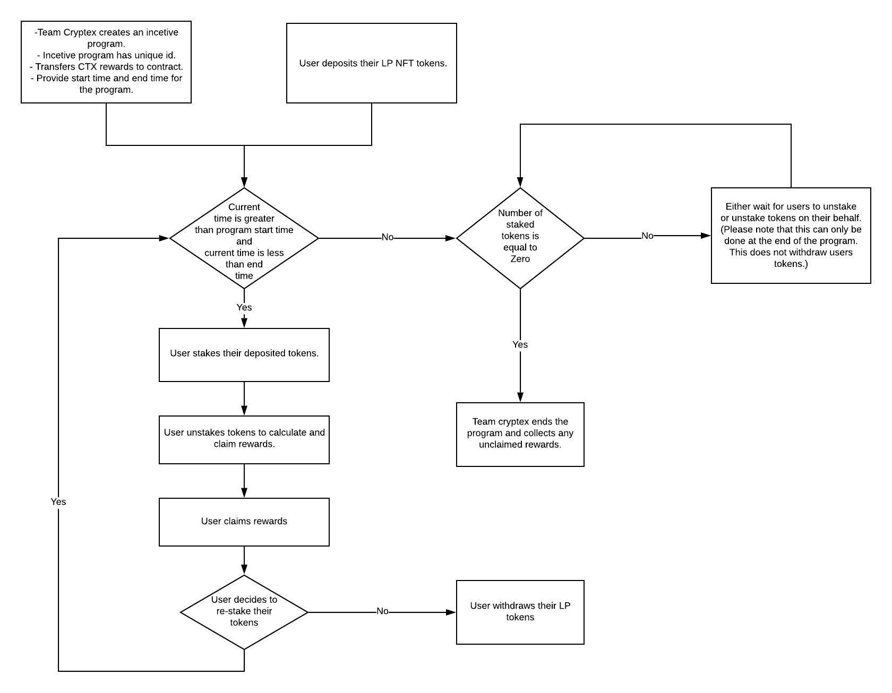

# CTX liquidity mining for Uniswap v3

Uniswap v3 replaced the old liquidity position ERC20 token with ERC-721 style NFT. Because of this our smart contract for Liquidity mining
was not compatible with Uniswap v3. 

### What is the new NFT style LP token about?

Uniswap V3 introduced the concept of concentrated liquidity positions which in brief means that liquidity providers can choose a custom 
price range for trading their tokens. Fees are distributed to LP tokens only when the price is in the position's range. All the metadata 
like the type of token pairs, the price range, the amount of liquidity provided, and the fees earned by each token is stored in the NFT.

### Algorithm for distributing rewards

Since fees are distributed only when the LP token is the position's range, rewards are also distributed in a similar way. For a detailed 
explanation of the algorithm please read this [article](https://www.paradigm.xyz/2021/05/liquidity-mining-on-uniswap-v3).
In short, the algorithm calculates the reward amount by diving the total unclaimed rewards by the total number of seconds for which fees
were generated by the LP token.

### The smart contract for liquidity mining for Uniswap v3

Uniswap Labs has created a smart contract for distributing rewards for liquidity mining. 
The code for it can be found [here](https://github.com/Uniswap/v3-staker). 


### Smart contract workflow




1. <ins>Create Incentive Program:</ins> The smart contract can be used to create several incentive programs to incentivize users to 
	 provide liquidity on uniswap v3 in return for rewards. Every incentive program has a unique identification key, a reward token, 
	 a pre-allocated reward amount, program start time, end time and the LP token pairs. The `Cryptex.Finance` DAO will create 
	 the incentive program for a token pair by providing the above mentioned details to the contract.
2. <ins>Deposit Token:</ins> Users can deposit their LP tokens before or after the incentive program starts. If a token is deposited
	 before the program starts then that token will not be considered as staked. A user can deposit all their LP tokens for the 
	 token pair the incentive programming is running for.
3. <ins>Stake Token:</ins> If a user deposits their LP tokens before the program starts then the user needs to stake every unstaked token 
	 so that they are considered for rewards distribution. A user can only stake tokens if the program is ongoing. The unique 
	 identification key of the incentive program is used to enter program. This detail will be hidden from the end user and it will be 
	 handled by the User Interface(UI).  
4. <ins>Unstake Token:</ins> A user must unstake their tokens in order to claim rewards. When a user unstakes, their rewards are calculated 
	 and their rewards balance gets updated. Any user who decides to claim their rewards midway during the program should unstake their 
	 tokens before claiming rewards.
5. <ins>Claim Rewards:</ins> A user can only claim tokens for a given LP token only if they've unstaked their token first. The reward 
	 tokens are transferred to the user when they claim their tokens and their rewards balance is reduced by the number of tokens claimed.
6. <ins>Re-stake Token:</ins> If a user unstaked their tokens for claiming rewards, then they can re-stake their tokens by 
	 following step `3`. 
7. <ins>Withdraw Token:</ins> A user can exit the program by withdrawing their tokens. They can only withdraw if they've 
	 unstaked their tokens. If a user decides to re-stake their tokens after withdrawing then they can follow step `2`.
8. <ins>Unstake Tokens Belonging To Other Users:</ins> Once the program is over anyone can unstake tokens belonging to other users. 
	 Please note that this only unstakes the tokens. It does not withdraw the tokens. This is helpful if the second condition of step `9` 
	 needs to be met.
9. <ins>End Incentive:</ins> The `Cryptex.Finance` DAO can end the incentive program after the program end time is over and collect any 
	 unclaimed rewards. Another pre-requisite for ending the program is that all users should unstake their tokens. Please refer to step `8`
	 to unstake tokens belonging to others.
 

## Technical Docs

### Create an Incentive program for liquidity mining

[UniswapV3Staker](https://github.com/Uniswap/v3-staker/blob/main/contracts/UniswapV3Staker.sol) will be used for
liquidity mining for Uniswap V3. The Contract is deployed at `0xe34139463bA50bD61336E0c446Bd8C0867c6fE65` on all networks
This will be created by Cryptex's DAO.
```javascript
hre = require('hardhat');
abi = require('./integration_docs/abi/UniswapV3Staker.json');
namedAccounts = await hre.getNamedAccounts();
v3StakerAddress = "0xe34139463bA50bD61336E0c446Bd8C0867c6fE65";
ctxAddress = "0xAa715DbD2ED909B7B7727dC864F3B78276D14A19"; // Please use correct CTX address based on network
CTX = await hre.ethers.getContractAt("Ctx", ctxAddress);
rewardAmount = hre.ethers.utils.parseEther("9000");
await CTX.approve(v3StakerAddress, rewardAmount);
accounts = await hre.ethers.getSigners();
v3Staker =  new ethers.Contract(
	v3StakerAddress,
	abi,
	accounts[0]
);
uniswapEthCtxPoolAddress = "0xfb7BDD5B703f57BC7807b9D731503050EdC8c722"; // Please use correct ETH-TCAP pool address. This is currently the address of the pool on rinkenby 

startTime = (await accounts[0].provider.getBlock("latest")).timestamp + 15 * 60; // + 15 minutes
endTime = startTime + 180 * 24 * 60 * 60; // start time + 180 days
times = {
	startTime,
	endTime
}
key = {
		pool: uniswapEthCtxPoolAddress,
		rewardToken: ctxAddress,
		...times,
		refundee: namedAccounts.deployer,
}
await v3Staker.createIncentive(key, rewardAmount)
```

### Fetch all LP NFT's owned by a user

Uniswap's [NonfungiblePositionManager](https://docs.uniswap.org/protocol/reference/periphery/NonfungiblePositionManager)
can be used to query all the LP NFT tokens. The contract address is `0xC36442b4a4522E871399CD717aBDD847Ab11FE88` on all networks.
```javascript
ethers = require('ethers');
abi = require('./integration_docs/abi/NonfungiblePositionManager.json'); // Please adjust path accordingly
nft = new ethers.Contract(
	"0xC36442b4a4522E871399CD717aBDD847Ab11FE88",
	abi,
	ethers.getDefaultProvider('rinkeby') // Please change the network accordingly
);
userAddress = "0xb85f30B1bA4513D1260B229348955d5497CcB55e"; // fetch this from the Users Wallet
noOfTokensOwnedByUser = await nft.balanceOf(userAddress);
if (noOfTokensOwnedByUser > 0) {
	tokenIDsOwnedByUser = await Promise.all(
		Array.from(
			{length:noOfTokensOwnedByUser}, 
			async (val,ind) =>  await nft.tokenOfOwnerByIndex(userAddress, ind)
		)
	)
} else {
	tokenIDsOwnedByUser = []
}
```

### Deposit and Stake Users token

```javascript
hre = require('hardhat');
abi = require('./integration_docs/abi/NonfungiblePositionManager.json'); // Please adjust path accordingly
v3StakerAddress = "0xe34139463bA50bD61336E0c446Bd8C0867c6fE65";
nftAddress = "0xC36442b4a4522E871399CD717aBDD847Ab11FE88";
nft = new ethers.Contract(
	nftAddress,
	abi,
	ethers.getDefaultProvider('rinkeby') // Please change the network accordingly
);
namedAccounts = await hre.getNamedAccounts();
ctxAddress = "0xAa715DbD2ED909B7B7727dC864F3B78276D14A19"; // Please use correct CTX address based on network
uniswapEthCtxPoolAddress = "0xe481b12ac5664f34c3a4a1ab01dfa3e610ed1169"; // Please use correct ETH-CTX pool address
userAddress = "0xb85f30B1bA4513D1260B229348955d5497CcB55e"; // fetch this from the Users Wallet
// startTime and endTime can be fetched from etherscan events
// eg. https://goerli.etherscan.io/tx/0x622f7182c3c84d8ddeab5f32774e8ccb21190d96fcbaa4b8459525167e4a32a5#eventlog
dataMap = {
		pool: uniswapEthCtxPoolAddress,
		rewardToken: ctxAddress,
		startTime: 1644264380, // Please make sure that this matches the deploy startTime
		endTime: 1659816380, // Please make sure that this matches the deploy endTime
		refundee: namedAccounts.deployer,
};
// Below are the exact values for rinkeby
//dataMap = {
//  pool: '0xfb7BDD5B703f57BC7807b9D731503050EdC8c722',
//  rewardToken: '0xAa715DbD2ED909B7B7727dC864F3B78276D14A19',
//  startTime: 1647347412,
//  endTime: 1662899412,
//  refundee: '0x570f581D23a2AB09FD1990279D9DB6f5DcE18F4A'
//}
abiCoder = new hre.ethers.utils.AbiCoder();
INCENTIVE_KEY_ABI = 'tuple(address rewardToken, address pool, uint256 startTime, uint256 endTime, address refundee)';
data = abiCoder.encode([INCENTIVE_KEY_ABI], [dataMap]);
// Please refer to `Fetch all LP NFT's owned by a user` section to get `tokenIDsOwnedByUser`
// USER_ACCOUNT will come from the wallet connected in UI
// Since there can be multiple tokenIDsOwnedByUser, We might a drop down for user to select the NFT they'd like to deposit
await nft.connect(USER_ACCOUNT).approve(v3StakerAddress, tokenIDsOwnedByUser[0]);

// Please note that if data is not provided then token won't be staked. 
// The token will have to be staked separately in such a case.
await nft.connect(USER_ACCOUNT)['safeTransferFrom(address,address,uint256,bytes)'](
	userAddress, v3StakerAddress, tokenIDsOwnedByUser[0], data
);
```

### Stake User Token
If a user deposited their tokens before the program started or if data was not provided in the previous section
then the token needs to be staked.

```javascript
hre = require('hardhat');
abi = require('./integration_docs/abi/UniswapV3Staker.json');
v3StakerAddress = "0xe34139463bA50bD61336E0c446Bd8C0867c6fE65";
v3Staker =  new ethers.Contract(
	v3StakerAddress,
	abi,
	ethers.getDefaultProvider('rinkeby')
);
key = {
		pool: uniswapEthCtxPoolAddress,
		rewardToken: ctxAddress,
		startTime: 1644264380, // Please make sure that this matches the deploy startTime
		endTime: 1659816380, // Please make sure that this matches the deploy endTime
		refundee: namedAccounts.deployer,
};
// key for rinkeby
//key = {
//  pool: '0xfb7BDD5B703f57BC7807b9D731503050EdC8c722',
//  rewardToken: '0xAa715DbD2ED909B7B7727dC864F3B78276D14A19',
//  startTime: 1647347412,
//  endTime: 1662899412,
//  refundee: '0x570f581D23a2AB09FD1990279D9DB6f5DcE18F4A'
//}
await v3Staker.connect(USER_ACCOUNT).stakeToken(key, tokenIDsOwnedByUser[0]);
```


### UnStake Users token

```javascript
hre = require('hardhat');
abi = require('./integration_docs/abi/UniswapV3Staker.json');
v3StakerAddress = "0xe34139463bA50bD61336E0c446Bd8C0867c6fE65";
v3Staker =  new ethers.Contract(
	v3StakerAddress,
	abi,
	ethers.getDefaultProvider('rinkeby')
);
key = {
		pool: uniswapEthCtxPoolAddress,
		rewardToken: ctxAddress,
		startTime: 1644264380, // Please make sure that this matches the deploy startTime
		endTime: 1659816380, // Please make sure that this matches the deploy endTime
		refundee: namedAccounts.deployer,
};
// key for rinkeby
//key = {
//  pool: '0xfb7BDD5B703f57BC7807b9D731503050EdC8c722',
//  rewardToken: '0xAa715DbD2ED909B7B7727dC864F3B78276D14A19',
//  startTime: 1647347412,
//  endTime: 1662899412,
//  refundee: '0x570f581D23a2AB09FD1990279D9DB6f5DcE18F4A'
//}
await v3Staker.connect(USER_ACCOUNT).unstakeToken(key, tokenIDsOwnedByUser[0]);
```

### Get User Rewards Info
Please note that rewards info can only be fetched for a single LP token

```javascript
hre = require('hardhat');
abi = require('./integration_docs/abi/UniswapV3Staker.json');
v3StakerAddress = "0xe34139463bA50bD61336E0c446Bd8C0867c6fE65";
v3Staker =  new ethers.Contract(
	v3StakerAddress,
	abi,
	ethers.getDefaultProvider('rinkeby')
);
key = {
		pool: uniswapEthCtxPoolAddress,
		rewardToken: ctxAddress,
		startTime: 1644264380, // Please make sure that this matches the deploy startTime
		endTime: 1659816380, // Please make sure that this matches the deploy endTime
		refundee: namedAccounts.deployer,
};
// key for rinkeby
//key = {
//  pool: '0xfb7BDD5B703f57BC7807b9D731503050EdC8c722',
//  rewardToken: '0xAa715DbD2ED909B7B7727dC864F3B78276D14A19',
//  startTime: 1647347412,
//  endTime: 1662899412,
//  refundee: '0x570f581D23a2AB09FD1990279D9DB6f5DcE18F4A'
//}
{reward, secondsInsideX128} = await v3Staker.getRewardInfo(key, tokenIDsOwnedByUser[0]);
```

### Claim User Rewards

Please refer to the previous section to get rewards info.

```javascript
hre = require('hardhat');
abi = require('./integration_docs/abi/UniswapV3Staker.json');
v3StakerAddress = "0xe34139463bA50bD61336E0c446Bd8C0867c6fE65";
v3Staker =  new ethers.Contract(
	v3StakerAddress,
	abi,
	ethers.getDefaultProvider('rinkeby')
);
ctxAddress = "0x144d7bc79d11fd09ea2ff211ae422157a4b4e011"; // Please use correct CTX address based on network
// Unstake the token before claiming rewards
// Also, look at the `Get Rewards Info` section for rewards amount
await v3Staker.connect(USER_ACCOUNT).claimReward(ctxAddress, USER_ADDRESS, rewardAmount);
```

### Withdraw User Token

If a user has unstaked their token, then they can exit by withdrawing their token

```javascript
hre = require('hardhat');
abi = require('./integration_docs/abi/UniswapV3Staker.json');
v3StakerAddress = "0xe34139463bA50bD61336E0c446Bd8C0867c6fE65";
v3Staker =  new ethers.Contract(
	v3StakerAddress,
	abi,
	ethers.getDefaultProvider('rinkeby')
);
await v3Staker.connect(USER_ACCOUNT).withdrawToken(tokenIDsOwnedByUser[0], USER_ADDRESS, "0x");
```

### End Incentive Program
This action will be executed by the Cryptex DAO.
A program can be exited when:
1. The endTime for the program has passed.
2. All users have unstaked their tokens
```javascript
hre = require('hardhat');
abi = require('./integration_docs/abi/UniswapV3Staker.json');
v3StakerAddress = "0xe34139463bA50bD61336E0c446Bd8C0867c6fE65";
accounts = await hre.ethers.getSigners();
v3Staker =  new ethers.Contract(
	v3StakerAddress,
	abi,
	acounts[0]
);

key = {
		pool: uniswapEthCtxPoolAddress,
		rewardToken: ctxAddress,
		startTime: 1644264380, // Please make sure that this matches the deploy startTime
		endTime: 1659816380, // Please make sure that this matches the deploy endTime
		refundee: namedAccounts.deployer,
};
// key for rinkeby
//key = {
//  pool: '0xfb7BDD5B703f57BC7807b9D731503050EdC8c722',
//  rewardToken: '0xAa715DbD2ED909B7B7727dC864F3B78276D14A19',
//  startTime: 1647347412,
//  endTime: 1662899412,
//  refundee: '0x570f581D23a2AB09FD1990279D9DB6f5DcE18F4A'
//}
await v3Staker.endIncentive(key);
```

### Create incentive program on Mainnet

```javascript
hre = require('hardhat');
abi = require('./integration_docs/abi/UniswapV3Staker.json');
namedAccounts = await hre.getNamedAccounts();
v3StakerAddress = "0xe34139463bA50bD61336E0c446Bd8C0867c6fE65";
ctxAddress = "0x321C2fE4446C7c963dc41Dd58879AF648838f98D";
CTX = await hre.ethers.getContractAt("Ctx", ctxAddress);
rewardAmount = hre.ethers.utils.parseEther("50000"); // 50K CTX rewards
data = await CTX.populateTransaction.approve(v3StakerAddress, rewardAmount);
delete data["from"];
console.log("data to approve CTX", data);
accounts = await hre.ethers.getSigners(); // Assuming hardhat has the signer private key.
v3Staker =  new ethers.Contract(
	v3StakerAddress,
	abi,
	accounts[0]
);
uniswapEthTCAPPoolAddress = "0x11456b3750E991383bB8943118ed79C1afdEE192";  

startTime = (await accounts[0].provider.getBlock("latest")).timestamp+ 15 * 60 * 60; // + 15 minutes
endTime = startTime + 92 * 24 * 60 * 60; // start time + 92 days days
times = {
	startTime,
	endTime
}
key = {
		pool: uniswapEthTCAPPoolAddress,
		rewardToken: ctxAddress,
		...times,
		refundee: namedAccounts.deployer,
}
console.log(key);
data = await v3Staker.populateTransaction.createIncentive(key, rewardAmount);
delete data["from"];
console.log("data to createIncentive", data);
```

### Uniswap APR calculation strategy

```graphql
type StakedPosition {
	tokenId: ID!
	active: Bool!
	liquidity: BigInt!
	tickLower: BigInt!
	tickUpper: BigInt!
}

APRInfo {
	APR: Float
}
```

On event [DepositTransferred](https://github.com/Uniswap/v3-staker/blob/4328b957701de8bed83689aa22c32eda7928d5ab/contracts/UniswapV3Staker.sol#L163) do the following:
```javascript
\\ We might need to check if the position already exists.
\\ We check this byt querying the graph using tokenID
\\ If it doesn't exits then
nftInfo = await nft.positions(event.tokenId)
let stakedPosition = new StakedPosition()
stakedPosition.tokenID = event.tokenId
stakedPosition.active = false
stakedPosition.liquidity = nftInfo.liquidity
stakedPosition.tickLower = nftInfo.tickLower
stakedPosition.tickUpper = nftInfo.tickUpper
stakedPosition.save()
```

On event [TokenStaked](https://github.com/Uniswap/v3-staker/blob/4328b957701de8bed83689aa22c32eda7928d5ab/contracts/UniswapV3Staker.sol#L348)
```javascript
\\ query StakedPosition by event.tokenID
stakedPosition.active = true
stakedPosition.save()
\\ Trigger the job below
```

On event [TokenUnStaked](https://github.com/Uniswap/v3-staker/blob/4328b957701de8bed83689aa22c32eda7928d5ab/contracts/UniswapV3Staker.sol#L259)
```javascript
\\ query StakedPosition by event.tokenID
stakedPosition.active = false
stakedPosition.save()
\\ Trigger the job below
```

On event [Swap](https://github.com/Uniswap/v3-core/blob/8f3e4645a08850d2335ead3d1a8d0c64fa44f222/contracts/UniswapV3Pool.sol#L786)
```javascript
function tick_to_price(tick) {
	return 1.0001 ** tick;
}
// pool address 0x11456b3750E991383bB8943118ed79C1afdEE192
slot0 = await pool.slot0();
currentTick = slot0.tick;
current_sqrt_price = tick_to_price(currentTick/2);

\\ query all the active StakedPosition

total_amount0 = 0
total_amount1 = 0
for stakedPositon in Active Staked positons:
	sa = tick_to_price(stakedPositon.tick_lower / 2)
	sb = tick_to_price(stakedPositon.tick_upper / 2)
	liquidity = stakedPositon.liquidity
	if (tick_lower < currentTick) &&  (currentTick < tick_upper):
		amount0 = liquidity * (sb - current_sqrt_price) / (current_sqrt_price * sb)
		amount1 = liquidity * (current_sqrt_price - sa)
		adjusted_amount0 = amount0 / (10 ** 18)
		adjusted_amount1 = amount1 / (10 ** 18)
		total_amount0 += adjusted_amount0
		total_amount1 += adjusted_amount1

// Fetch TCAP price and ETH price from the oracles and normalize the zeroes
TVL_USD = total_amount0 * tcap_price + total_amount1 * eth_price
CTX_REWARD = 50000
reward_rate = CTX_REWARD / 92 // 92 days duration
APR = (reward_rate * CTX_PRICE_USD * 365 * 100)/ (TVL_USD)
APRInfo.APR = APR
APRInfo.save()
```
